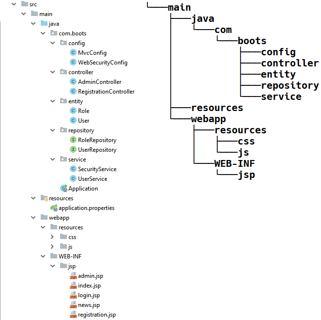

Что хранится в каждом пакете:

src\main\java\com\boots\config — классы с конфигурациями для MVC (MvcConfig) и безопасности (WebSecurityConfig);

src\main\java\com\boots\controller — классы с контроллерами;

src\main\java\com\boots\entity — классы с моделями;

src\main\java\com\boots\repository — интерфейсы репозиториев;

src\main\java\com\boots\service — классы c сервисами для моделей;

src\main\webapp\resources — статические объекты: js, css, img;

src\main\webapp\WEB-INF\jsp — представления в виде файлов .jsp.

